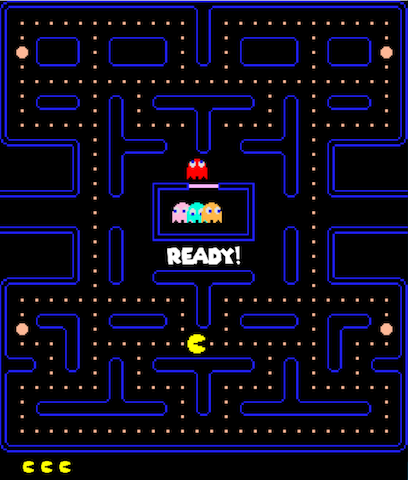

Pacman clone in C using SDL2

## Description

This is my attempt at building something interesting after learning C. The game utilises A* algorithm for ghost AI with each ghost having a unique
pathfinding pattern to make their chase less predictable. After a while ghosts enter scatter mode to give a player some rest. Ghosts speed up whenever 
there are 50 balls left on the map. 

## Requirements

- GCC compiler https://gcc.gnu.org/install/download.html
- SDL2 and SLD_image libraries https://www.libsdl.org/download-2.0.php

## Installation

_Make sure you've installed both SDL2 and SDL2-image libraries. Run Makefile in the src folder with `make pacman`. After that you can run the game from terminal with `./pacman`_

## Controls

- Use arrow keys to move
- Press Space to continue after game over
- Press Esc to exit the game whenever you want. 

## Author

matanai 

## License

This program is released under an MIT License